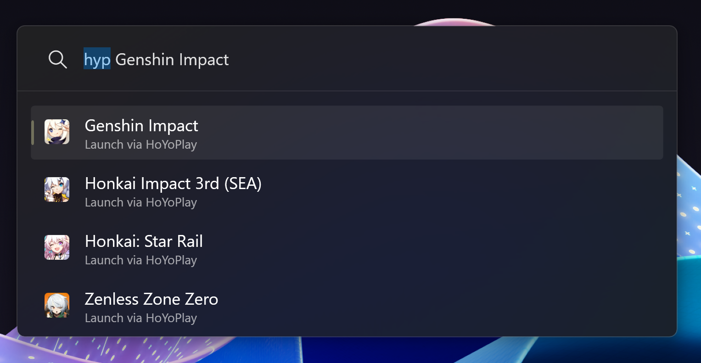

# PowerToysRun.HoYoPlay

This is a plugin for PowerToys Run and Command Prompt that allows you to start the game without making multiple clicks.

How it works is it interacts with the launcher URI Scheme that is already provided by the launcher to send flags to start the game.

To launch a game, just type `hyp` follow by the Game Name, and HoYoPlay will launch the game.

[Download the latest release here](https://github.com/studiobutter/HoYoPlay-Quick-Launch/releases/tag/v0.1.5)

Side Note:

- The launcher will still open, but the game should load immediately. This is intended behavior, and I can't turn it off since it's launcher's related setting. Also, there's no launch in Minimized in HoYoPlay Settings.
- You can turn on Global Search in settings, but it's not advised since unless you removed the shortcuts on the desktop and start menu which fun fact does launch the launcher but doesn't launch the game. This plugin instantly launches the game without clicking "Start Game".

Installing Guide: 

To install the plugin:

- Extract the `PowerToysRun.HoYoPlay.zip` file (or `PowerToysRun.HoYoPlay.CN.zip` for Mainland Client)
- Head to `%LocalAppData%\Microsoft\PowerToys\PowerToys Run\Plugins\`
- Open the Plugin Folder and make a new Plugin Folder. Name it however you what. (IDK how it works, does it check folder names)
  - I suggest setting the Plugin Folder name = the ZIP File Name. (i.e: `PowerToysRun.HoYoPlay` for Overseas and `PowerToysRun.HoYoPlay.CN` for Mainland China)
- Copy the extracted contents to the Plugin Folder and restart PowerToys